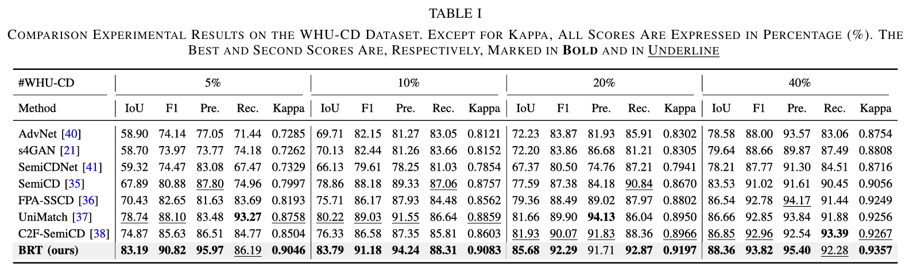
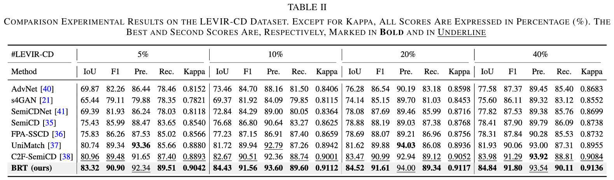
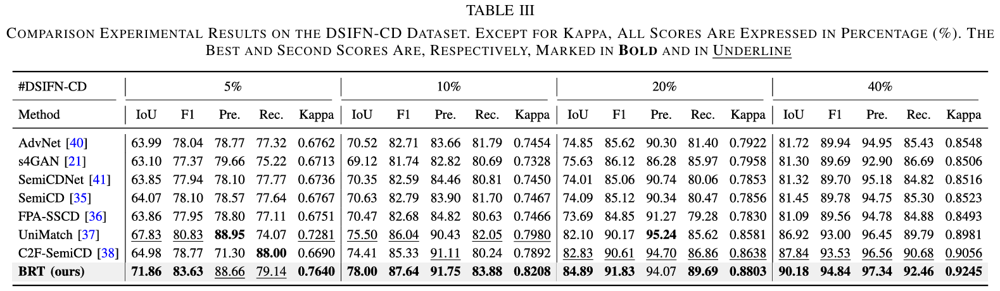

## Introduction
Welcome to the official repository of our paper "[*Semi-Supervised Change Detection With Boundary Refinement Teacher*](https://ieeexplore.ieee.org/document/10965597)"! Our paper has been accepted by IEEE Transactions on Geoscience and Remote Sensing (TGRS)

<p align="center">

</p>

Overview of the proposed SSCD method BRT. Pairs of (x1, x2) and (u1, u2) are applied to the supervised branch and the semi-supervised branch, respectively In the supervised branch, GT is used to supervise the weakly augmented labeled data. In the semi-supervised branch, weak and strong augmentations are applied to the unlabeled data. We propose six steps (highlighted in red) to guide SSCD. We perform inference with the CDT model in Step #1 and extract and filter boundary blocks within Step #2 and Step #3, respectively. Then, the BDN is utilized to re-delineate boundaries in Step #4, and the delineation results are merged to refine CD predictions in Step #5. Finally, STPU is applied in Step #6 to assess the student model and update the CDT model.

## Results
### WHU-CD
Comparison experimental results on the WHU-CD dataset. Except for kappa, all scores are expressed in percentage (%). The best and second scores are, respectively, marked in bold and in underline.

<p align="center">

</p>

### LEVIR-CD
Comparison experimental results on the LEVIR-CD dataset. Except for kappa, all scores are expressed in percentage (%). The best and second scores are, respectively, marked in bold and in underline.
<p align="center">

</p>

### DSIFN-CD
Comparison experimental results on the DSIFN-CD dataset. Except for kappa, all scores are expressed in percentage (%). The best and second scores are, respectively, marked in bold and in underline.
<p align="center">

</p>

## Reproduce
We provide the student model weights and BDN weights for the WHU-CD and LEVIR-CD datasets. Please download them below. We warmly welcome comparisons with our work. Please place the CD and BDN of the dataset in the corresponding `exp` folder in the corresponding section of the code.

### Student model weights and BDN weights

| Dataset/Ratio | CD/BDN (ckpt) | Dataset/Ratio | CD/BDN (ckpt) |
| :---: | :---: | :---: | :---: |
| WHU-CD 5% | [[CD](https://drive.google.com/file/d/1qHzMyIalO_Elz0VzFqx1UNGlo6szLtV6/view?usp=sharing)]/[[BDN](https://drive.google.com/file/d/1QEH3ukCHtMN97ildZ7KKiBXWBMHgugMc/view?usp=sharing)] | LEVIR-CD 5% | [[CD](https://drive.google.com/file/d/1SVqR59Sx3aWeDZB2SYZwK4lAPid6YxLU/view?usp=sharing)]/[[BDN](https://drive.google.com/file/d/1JMcrhJdbzF_Zm07JX_LPcZYkfbPp4RD9/view?usp=sharing)] |
| WHU-CD 10% | [[CD](https://drive.google.com/file/d/173PnHODVpbhK8BAr9thnnUUjF4xHXrw0/view?usp=sharing)]/[[BDN](https://drive.google.com/file/d/1wvXH-CLvh-9uSadEoj1g-gG6TOmuiDvt/view?usp=sharing)] | LEVIR-CD 10% | [[CD](https://drive.google.com/file/d/1Z0r9KvYkhqrgAhQMgrOO5_uiPi7jUPEp/view?usp=sharing)]/[[BDN](https://drive.google.com/file/d/1B0bcfCh7_maS4OEOCPpim4NyzFsH7xSq/view?usp=sharing)] |
| WHU-CD 20% | [[CD](https://drive.google.com/file/d/1WDiTrFtmFJHxLGyJEIvhQKqVU82a_7MT/view?usp=sharing)]/[[BDN](https://drive.google.com/file/d/1ObVFe2sSSMDgTpC37zx1GiadYO5uRUly/view?usp=sharing)] | LEVIR-CD 20% | [[CD](https://drive.google.com/file/d/1VcD9AYzAoC29keJ1u1H-lqu9vPWdF9UO/view?usp=sharing)]/[[BDN](https://drive.google.com/file/d/1mZbTjELnEJXGzA_-0j27Lo15giterpBq/view?usp=sharing)] |
| WHU-CD 40% | [[CD](https://drive.google.com/file/d/1ajKELw1W_iMSHDWLEyOJ_v2x0Oan63Fz/view?usp=sharing)]/[[BDN](https://drive.google.com/file/d/1VgxEVdyvSXXW2RL92thhlJa7n4uDmjq7/view?usp=sharing)] | LEVIR-CD 40% | [[CD](https://drive.google.com/file/d/1ePys63U_C3OvrXInr7B1dae36zFDwOdm/view?usp=sharing)]/[[BDN](https://drive.google.com/file/d/1Oi8bd6-FJWe_pj7wR_-IurP-DN2ATsqi/view?usp=sharing)] |

Alternatively, you can download weights using the [Google Drive folder path](https://drive.google.com/drive/folders/1E1YKd1tM90AddHYM-_DhcnLSXW9Z9Fp9?usp=sharing).


For example, reproducing the result of WHU-CD 40%:
* `Google Drive/~/best.pth` -> `BRT/exp/WHU/40/CD/best.pth`
* `Google Drive/~/best.pth` -> `BRT/exp/WHU/40/BDN/best.pth`

### Pretrained Backbone

- [ResNet-50](https://drive.google.com/file/d/1mqUrqFvTQ0k5QEotk4oiOFyP6B9dVZXS/view?usp=sharing)
* `Google Drive/resnet50.pth` -> `BRT/pretrained/resnet50.pth`

### Usage

Replace the dataset path in the code and run the below script.
```
python eval_BRT-SemiCD.py
```

* `eval_BRT-SemiCD.py`: **With** Boundary Delineation Network (BDN).
* `test_BRT-SemiCD.py`: **Without** Boundary Delineation Network (BDN).
* `train_BRT-SemiCD.py`: Train Boundary Refinement Teacher (BRT).

## Train
### Option 1. Train BRT with our pretrained BDN weights
We provide BDN weights of 5%, 10%, 20%, and 40% for the WHU-CD and LEVIR-CD datasets [here](https://drive.google.com/drive/folders/1E1YKd1tM90AddHYM-_DhcnLSXW9Z9Fp9?usp=sharing). Please place it in the `BDN` folder corresponding to the `exp` dataset.

For example, training WHU-CD 40%:
* `Google Drive/BRT_CD/exp/WHU/40/BDN/best.pth` -> `BRT/exp/WHU/40/BDN/best.pth`

Replace the dataset path and ratio in the code and run the script below.
```
python train_BRT-SemiCD.py 2>&1 | tee WHU_40.log
```


### Option 2. Train BRT from Zero (need to pretrain BDN)

Please refer to [BIBR](https://github.com/yogurts-sy/BIBR) to pretrain BDN weights and place its weights in the `BDN` folder corresponding to the `exp` dataset. The training of BDN utilizes boundary blocks cropped from semi-supervised datasets with ratios of 5%, 10%, 20%, and 40%.

Replace the dataset path and ratio in the code and run the script below.
```
python train_BRT-SemiCD.py 2>&1 | tee WHU_40.log
```

## Acknowledgement

This project is based on [BPR](https://github.com/chenhang98/BPR/tree/main) and [UniMatch](https://github.com/LiheYoung/UniMatch). Thank you very much for their outstanding work.

## Citation

If you find this project useful in your research, please consider citing:

```
@article{su2025semi,
  title={Semi-Supervised Change Detection With Boundary Refinement Teacher},
  author={Su, You and Song, Yonghong and Wu, Xiaomeng and Hu, Hao and Chen, Jingqi and Wen, Zehan},
  journal={IEEE Transactions on Geoscience and Remote Sensing},
  year={2025},
  publisher={IEEE}
}
```
